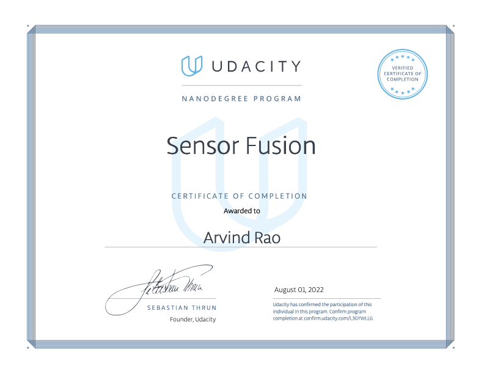

# Sensor Fusion Nanodegree Final Project Submissions

This repository contains my final project submissions for each lesson of Udacity's [Sensor Fusion Nanodegree Program](https://www.udacity.com/course/sensor-fusion-engineer-nanodegree--nd313). All submissions are implemented in C++, except for the radar project which is in Matlab.

**Note**: *The project codes stored in this repository are meant to exhibit my code and reports. If interested in runnable code please follow the links in the project list below.*

## Projects

- [Lidar - Obstacle Detection](https://github.com/arvsrao/SFND_Lidar_Obstacle_Detection): From Lidar measurements of a traffic scene filter out points to the left and right of the roadway and points representing the roadway itself. Then detect obstacles by nearest neighbor clustering the filtered points. The implemented nearest neighbor algorithm uses a kD tree data structure to quickly find neighboring points.
- [Camera - 2D Feature Tracking](https://github.com/arvsrao/SFND_2D_Feature_Tracking):  As a preparation for the final project investigate various 2D keypoint detector / descriptor combinations to see which pairs perform best.
- [Camera - 3D Object Tracking](https://github.com/arvsrao/SFND_3D_Object_Tracking):  Build a collision detection system. Using work from the [2D Feature Tracking](https://github.com/arvsrao/SFND_2D_Feature_Tracking) project compute time-to-collision (TTC) to 3D objects (cars, bicycles, pedestrians, etc.) from camera features.  Also compute TTC from Lidar measurements. Project Lidar points into the camera image and associate the projected points with the detected 3D objects. [My final report](https://github.com/arvsrao/SFND_3D_Object_Tracking/SF-Final-Project.html).
- [Radar](https://github.com/arvsrao/SFND_Radar): Radar target generation and detection. CFAR processing of range - doppler image. [My final report](https://github.com/arvsrao/SFND_Radar/final_project_radar.html).
- [Kalman Filters - Tracking with Unscented Kalman Filters](https://github.com/arvsrao/SFND_Unscented_Kalman_Filter): Track vehicles on a multi-lane road using a constant turn rate and velocity (CTRV) magnitude model. Fuse Lidar and radar measurements in an unscented Kalman filter.

## Graduation Certificate 🎉🎉

[Link to Verified Certificate](https://confirm.udacity.com/L3GYWLLG)

